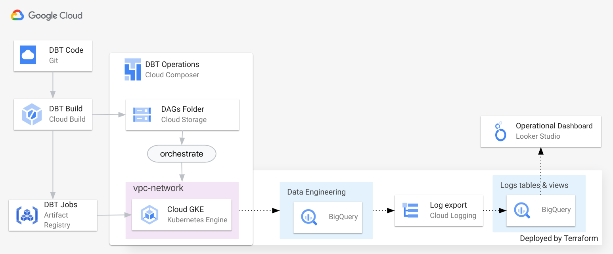

# terraform-google-dbt-composer-blueprint

## Description

### Overview

This module stands up an integrated DBT and Composer operations environment.

It does the following:
 * Applies required APIs and permissions in the project
 * Creates a documentation (for DBT) bucket
 * Creates a Composer environment, including VPC, and a service account
 * Copies across DAG utilities for Composer
 * Exports audit logs for the project into a BigQuery project, including two materialized views and a view on top to support dashboards

## Architecture



## Examples

An example can be found in [examples/dbt_job](examples/dbt_job/README.md) an end-to-end example is included that shows using the DAG utilities and standing up a simple DBT job in Cloud Composer.

## Cost

The major cost is in Cloud Composer Airflow. Cloud Build, Cloud Storage, Artifact Repository, and BigQuery are all costs that scale up and down with your usage, while Cloud Composer has minimum fixed costs depending on your side. It scales up with more work.

An example Cloud Composer 2 pricing can be found [here](https://cloud.google.com/composer/pricing#composer-2-example).

## Usage

Basic usage of this module is as follows:

```hcl

# Create DBT Composer setup
module "dbt_composer" {
  source  = "GoogleCloudPlatform/dbt-composer-blueprint/google"
  version = "~> 0.1"
  project_id   = "your project"
  region       = "your region for Composer"
  gcs_location = "your location for GCS"
  bq_location  = "your location for BigQuery"

  # Environment variables for the Airflow environment
  env_variables = {
    AIRFLOW_VAR_REPO : local.registry_url,
  }
}
```

<!-- BEGINNING OF PRE-COMMIT-TERRAFORM DOCS HOOK -->
## Inputs

| Name | Description | Type | Default | Required |
|------|-------------|------|---------|:--------:|
| bq\_location | The BQ location where the datasets will be created | `string` | n/a | yes |
| composer\_version | Version of Cloud Composer | `string` | `"composer-2.4.6-airflow-2.6.3"` | no |
| env\_variables | Variables of the airflow environment. | `map(string)` | `{}` | no |
| gcs\_location | The GCS location where the buckets will be created | `string` | n/a | yes |
| goog\_packaged\_solution | Google packaged solution label | `string` | `"gcp-dbt-composer"` | no |
| monitoring\_dataset | Dataset for monitoring activity | `string` | `"monitoring"` | no |
| project\_id | The project ID to deploy to | `string` | n/a | yes |
| region | The region for Cloud Composer | `string` | n/a | yes |

## Outputs

| Name | Description |
|------|-------------|
| airflow\_dag\_gcs\_prefix | Airflow GCS DAG prefix |
| airflow\_gke\_cluster | Airflow GKE Cluster |
| airflow\_uri | Airflow URI |
| docs\_gcs\_bucket | Documentation bucket |
| lookerstudio\_create\_dashboard\_url | Looker Studio template dashboard |

<!-- END OF PRE-COMMIT-TERRAFORM DOCS HOOK -->

## Requirements

These sections describe requirements for using this module.

### Software

The following dependencies must be available:

- [Terraform][terraform] v1.3
- [Terraform Provider for GCP][terraform-provider-gcp] plugin v3.53+

## Contributing

Refer to the [contribution guidelines](./CONTRIBUTING.md) for
information on contributing to this module.

[iam-module]: https://registry.terraform.io/modules/terraform-google-modules/iam/google
[project-factory-module]: https://registry.terraform.io/modules/terraform-google-modules/project-factory/google
[terraform-provider-gcp]: https://www.terraform.io/docs/providers/google/index.html
[terraform]: https://www.terraform.io/downloads.html

## Security Disclosures

Please see our [security disclosure process](./SECURITY.md).
